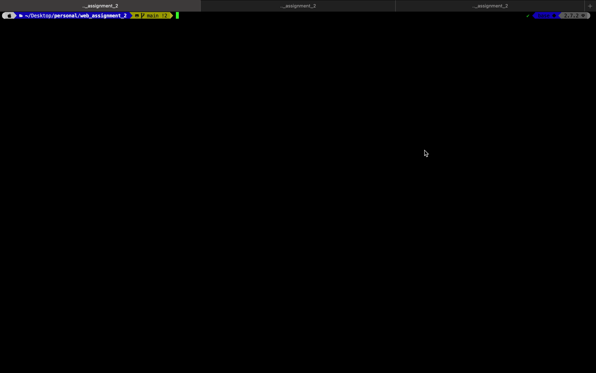

# Book Store App Projects 
In COMP3100 course, we have 3 individual assignments. 
Name As: web_assignment_1, web_assignment_2, and web_assignment_3.

### [web_assignment_1](https://github.com/yeeteing/web_assignment_1)
- Create a REST API for Book and Loan.
- Having a mock JSON data for Books and Loans.

### [web_assignment_2](https://github.com/yeeteing/web_assignment_2)
- Create unit test for the Book API.
- Store the Book's data in mongo db.

### [web_assignment_3](https://github.com/yeeteing/web_assignment_3)
- Developed a responsive web page for Library management with JQuery, ajax, HTML, and CSS. 
- The website need to communicate with the server API through ajax.

## web_assignment_2
Prerequisite: 
- [Node.js(LTS version will be fine) and npm](https://docs.npmjs.com/downloading-and-installing-node-js-and-npm#using-a-node-version-manager-to-install-node-js-and-npm)
- [mongodb](https://www.mongodb.com/try/download/community)
## To run the server
1. make sure you're in the root directory and run `npm install`
2. make sure mongo is installed
3. run `mongo`
4. in mongo shell: 
    a. run `use my-library`
    b. run `db.createCollection('books')`, and make sure it retun "{ "ok" : 1 }", 
    else: run `db.books.drop()` then `db.createCollection('books')`
5. open a new terminal and locate to web_assignment_2 directory, then run `node app.js`

## To communicate with this API
You will need [Postman](https://www.postman.com/downloads/).

Here is some example on what params, body, - url needed for each purpose.

### Add a new book. (POST Method)
- url: 'http://localhost:3000/books'
- body request example: 
```
{
    "id": 1,
    "name": "Testing",
    "authors": "Mr. Test",
    "year": "2021",
    "publisher": "testPublisher"
}
```


### Retrieve the information of a book by id. (GET Method)
- url: 'http://localhost:3000/books/{id}'


### List all books. (GET Method)
- url: 'http://localhost:3000/books'


### Update a book. (PUT Method)
- url: 'http://localhost:3000/books/{id}'
- body request example: 
```
{
    "id": 1,
    "name": "Testing Testing!!",
    "authors": "Mr. Test",
    "year": "2021",
    "publisher": "testPublisher"
}
```


### Delete a book. (DELETE Method)
- url: 'http://localhost:3000/books/{id}'


## To run the test
1. Open a terminal and run `node app.js`
2. Open another terminal and run `npm test`
3. If there is error. Try: 

    a. run `mongo`

    b. in mongo shell: 

        A. run `use my-library`

        B. run `db.createCollection('books')`, and make sure it retun "{ "ok" : 1 }", 
           else: run `db.books.drop()` then `db.createCollection('books')`

    c. in another terminal, re-run `node app.js`

    d. then run `npm test`

## Demo
### Unit Test:
